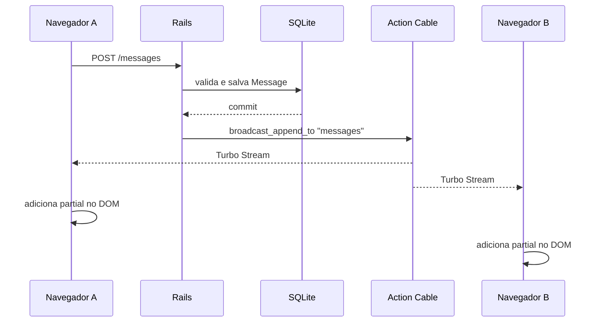

# Hotwire Realtime Demo

Laboratório pequeno para estudar comunicação em tempo real com Ruby on Rails,
Hotwire, Turbo Streams, Action Cable e Stimulus.

A aplicação implementa uma sala de chat simples. Uma mensagem é persistida no
SQLite e, depois do commit da transação, publicada por Action Cable. Todos os
navegadores conectados à sala recebem a nova mensagem através de Turbo Streams,
sem recarregar a página.

## Objetivos do laboratório

- Entender o fluxo completo de uma mensagem em uma aplicação Rails.
- Separar responsabilidades entre controller, model, view e JavaScript.
- Usar Turbo Streams para atualizar HTML em tempo real.
- Usar Action Cable como transporte WebSocket.
- Usar Stimulus somente para comportamento de interface local.
- Comparar o adapter `async` de desenvolvimento com Redis em produção.

## Stack

- Ruby `3.3.5` (definido em `.ruby-version`)
- Rails `7.2.3` ou superior dentro da série `7.2.3`
- SQLite3
- Puma
- Hotwire:
	- `turbo-rails` para navegação Turbo e Turbo Streams
	- `stimulus-rails` para comportamento JavaScript
	- Action Cable, incluído no Rails, para WebSockets
- Importmap para carregar JavaScript sem pipeline Node obrigatório
- Minitest, incluído no Rails, para testes
- RuboCop Rails Omakase para estilo
- Brakeman para análise de segurança

O `json` está fixado em uma versão menor que 3 porque o Rails 7.2 utiliza a
opção `quirks_mode` do encoder JSON, que não é aceita pelo `json 3.x` usado no
ambiente original deste projeto.

## Pré-requisitos

Instale ou tenha disponível:

- Ruby `3.3.5`
- Bundler
- SQLite3
- Node.js e Yarn não são necessários para o fluxo principal, pois o projeto
	usa Importmap.

Confira o ambiente:

```bash
ruby -v
bundle -v
sqlite3 --version
```

## Instalação

Na raiz do projeto:

```bash
bundle install
bin/rails db:prepare
```

`db:prepare` cria o banco quando necessário e aplica as migrations pendentes.

## Executando a aplicação

Inicie o servidor:

```bash
bin/rails server
```

Abra [http://localhost:3000](http://localhost:3000). A rota raiz exibe a sala
de chat.

Para testar o realtime, abra a aplicação em duas janelas ou navegadores,
envie uma mensagem em uma delas e observe a mensagem aparecer na outra.

## Como uma mensagem funciona



### 1. Renderização inicial

`MessagesController#index` busca as mensagens ordenadas por `created_at` e
cria um objeto vazio para o formulário:

```ruby
@messages = Message.order(:created_at)
@message = Message.new
```

A view renderiza cada registro com o partial `_message.html.erb`.

### 2. Assinatura do stream

Na view existe:

```erb
<%= turbo_stream_from "messages" %>
```

Isso cria uma assinatura do navegador ao stream assinado chamado `messages`.
O navegador passa a escutar atualizações enviadas pelo
`Turbo::StreamsChannel`.

### 3. Envio do formulário

`form_with model: @message` gera um formulário para `POST /messages`.
O controller extrai somente `username` e `content` usando `params.expect`,
cria o registro e redireciona para a sala quando o save é bem-sucedido.

Se a validação falhar, a mesma página é renderizada com status HTTP
`422 Unprocessable Entity` e os erros ficam disponíveis em `@message.errors`.

### 4. Persistência e broadcast

O model `Message` declara:

```ruby
after_create_commit -> {
	broadcast_append_to "messages", target: "messages"
}
```

O callback ocorre depois do commit, evitando publicar uma mensagem que ainda
poderia ser revertida. O Turbo renderiza o partial da nova mensagem e faz
append no elemento HTML com `id="messages"`.

### 5. Auto-scroll

O elemento principal da conversa usa:

```html
<main data-controller="chat">
```

O controller Stimulus observa alterações no DOM com `MutationObserver`. Quando
uma mensagem é adicionada, ele move o scroll para o final da conversa. Esse
comportamento é local ao navegador e não participa do broadcast.

## Rotas

| Método | Caminho | Ação | Finalidade |
| --- | --- | --- | --- |
| `GET` | `/` | `messages#index` | Exibe a sala e as mensagens |
| `POST` | `/messages` | `messages#create` | Valida e cria uma mensagem |
| `GET` | `/up` | `rails/health#show` | Health check do Rails |
| `GET` | `/service-worker` | `rails/pwa#service_worker` | Arquivo PWA gerado pelo Rails |
| `GET` | `/manifest` | `rails/pwa#manifest` | Manifesto PWA gerado pelo Rails |

Consulte todas as rotas com:

```bash
bin/rails routes
```

## Modelo e banco de dados

O model `Message` possui os atributos:

| Atributo | Tipo | Definição |
| --- | --- | --- |
| `id` | integer | Identificador gerado pelo banco |
| `username` | string | Nome informado pelo participante |
| `content` | text | Corpo da mensagem |
| `created_at` | datetime | Data e hora de criação |
| `updated_at` | datetime | Data e hora da última atualização |

As validações atuais exigem `username` e `content` preenchidos. A migration
responsável está em `db/migrate/`.

O banco de desenvolvimento fica em:

```text
storage/development.sqlite3
```

O banco de teste fica em `storage/test.sqlite3`. Arquivos gerados localmente
em `storage/` não devem ser versionados.

Comandos úteis:

```bash
bin/rails db:migrate
bin/rails db:rollback
bin/rails db:reset
bin/rails console
```

Exemplo no console:

```ruby
Message.create!(username: "Ada", content: "Hello from the room")
Message.order(:created_at)
```

## Action Cable

O arquivo `config/cable.yml` define o transporte por ambiente:

```yaml
development:
	adapter: async

test:
	adapter: test

production:
	adapter: redis
```

O adapter `async` é conveniente para desenvolvimento local em um único
processo. Para produção, Redis é necessário para que múltiplos processos ou
servidores compartilhem os broadcasts.

Configure a URL de produção com:

```bash
export REDIS_URL=redis://localhost:6379/1
```

O projeto ainda não inclui autenticação, múltiplas salas ou autorização. Todos
os clientes que assinam `messages` recebem as mensagens da mesma sala.

## Estrutura principal

```text
app/
	controllers/messages_controller.rb  # Entrada HTTP do chat
	models/message.rb                    # Validação e broadcast
	views/messages/index.html.erb       # Página e formulário
	views/messages/_message.html.erb    # HTML de uma mensagem
	javascript/application.js            # Importa Turbo e controllers
	javascript/controllers/chat_controller.js
																			# Auto-scroll da conversa
	assets/stylesheets/application.css  # Estilos da interface

config/
	routes.rb                            # Rotas HTTP
	cable.yml                            # Adapter do Action Cable
	database.yml                          # Configuração SQLite
	importmap.rb                          # Pins JavaScript

db/
	migrate/                              # Histórico do schema
	seeds.rb                              # Dados iniciais, atualmente vazio

Gemfile                                 # Dependências Ruby
Gemfile.lock                            # Versões resolvidas
bin/rails                               # CLI Rails do projeto
```

## Comandos de qualidade

Executar a suíte de testes:

```bash
bin/rails test
```

Executar o RuboCop nos arquivos Ruby do chat:

```bash
bundle exec rubocop app/models/message.rb app/controllers/messages_controller.rb
```

Executar análise de segurança:

```bash
bin/brakeman
```

Verificar whitespace no diff:

```bash
git diff --check
```

## Estado atual e limites

Este é um laboratório de aprendizado, não uma aplicação pronta para produção.
O escopo atual é deliberadamente pequeno:

- Não há usuários persistidos nem login.
- O `username` é texto livre e não representa identidade autenticada.
- Não há paginação ou limpeza do histórico.
- Não há testes de request, model, system ou JavaScript escritos ainda.
- O adapter de desenvolvimento não simula uma topologia distribuída.
- O conteúdo é salvo e exibido como texto; a view usa escaping padrão do Rails.

## Próximos experimentos

1. Adicionar testes de model para validações e broadcast.
2. Adicionar testes de request para `GET /` e `POST /messages`.
3. Criar usuários com autenticação e substituir `username` por uma associação.
4. Separar mensagens por sala usando `room_id` e streams diferentes.
5. Adicionar presença online com Action Cable.
6. Trocar o adapter local por Redis e executar mais de um processo Puma.
7. Adicionar paginação ou carregamento incremental do histórico.
8. Testar concorrência e ordenação de mensagens recebidas no mesmo instante.

## Licença

Nenhuma licença foi definida neste repositório até o momento.
