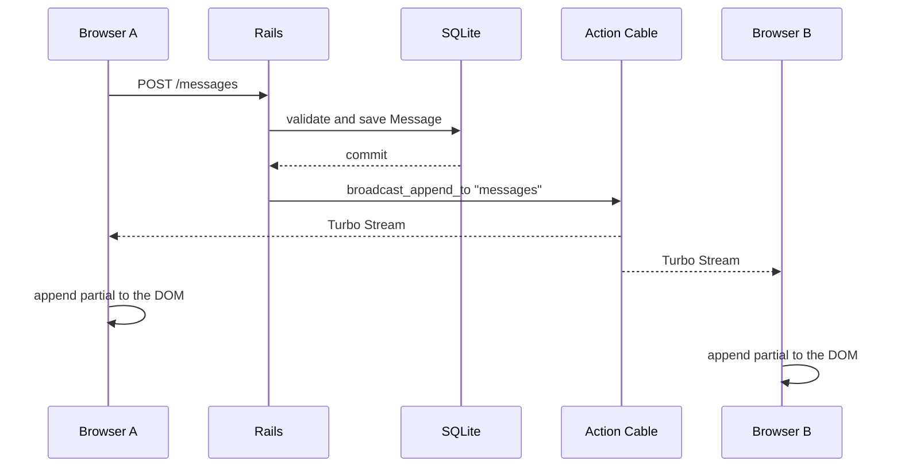

# Hotwire Realtime Demo

A small hands-on Rails lab for learning real-time communication with Hotwire,
Turbo Streams, Action Cable, and Stimulus.

The application implements a simple chat room. A message is persisted in
SQLite and, after the transaction commits, published through Action Cable. All
browsers connected to the room receive the new message through Turbo Streams,
without reloading the page.

## Why this exists

Real-time interfaces can look deceptively simple from the browser. This lab
isolates the full path of a chat message so each responsibility is visible:

1. The browser submits a message through a normal Rails form.
2. The controller validates and persists it.
3. The model broadcasts only after the database transaction commits.
4. Action Cable delivers a Turbo Stream to every connected browser.
5. Turbo appends the rendered partial without a full-page refresh.

The project also shows where Stimulus fits: it handles local browser behavior,
such as keeping the conversation scrolled to the latest message, while Action
Cable handles server-to-browser communication.

## What's in this repo

- `MessagesController#index` and `#create` - render the room and create messages
- `Message` - validates messages and broadcasts them after commit
- `app/views/messages/index.html.erb` - renders the room and message form
- `app/views/messages/_message.html.erb` - renders one message
- `turbo_stream_from "messages"` - subscribes each browser to the room stream
- `chat_controller.js` - keeps the local conversation scrolled to the bottom
- `config/cable.yml` - uses the `async` adapter in development and `redis` in production

## Objectives

- Understand the complete message flow in a Rails application.
- Separate responsibilities between the controller, model, view, and JavaScript.
- Use Turbo Streams to update HTML in real time.
- Use Action Cable as the WebSocket transport.
- Use Stimulus only for local interface behavior.
- Compare the development `async` adapter with Redis in production.

## Stack

- Ruby `3.3.5` (defined in `.ruby-version`)
- Rails `7.2.3` or newer within the `7.2.3` series
- SQLite3
- Puma
- Hotwire:
  - `turbo-rails` for Turbo navigation and Turbo Streams
  - `stimulus-rails` for JavaScript behavior
  - Action Cable, included with Rails, for WebSockets
- Importmap for loading JavaScript without a required Node pipeline
- Minitest, included with Rails, for tests
- RuboCop Rails Omakase for style
- Brakeman for security analysis

`json` is pinned below version 3 because Rails 7.2 uses the JSON encoder's
`quirks_mode` option, which is not accepted by `json 3.x` in the original
environment for this project.

## Requirements

Install or make sure these tools are available:

- Ruby `3.3.5`
- Bundler
- SQLite3
- Node.js and Yarn are not required for the main workflow because the project
  uses Importmap.

Check the environment:

```bash
ruby -v
bundle -v
sqlite3 --version
```

## Running it

From the project root:

```bash
bundle install
bin/rails db:prepare
bin/rails server
```

Open [http://localhost:3000](http://localhost:3000). The root route displays
the chat room.

To test realtime behavior, open the application in two windows or browsers,
send a message in one of them, and watch it appear in the other.

## How a message works



### 1. Initial rendering

`MessagesController#index` fetches messages ordered by `created_at` and creates
an empty object for the form:

```ruby
@messages = Message.order(:created_at)
@message = Message.new
```

The view renders each record with the `_message.html.erb` partial.

### 2. Stream subscription

The view contains:

```erb
<%= turbo_stream_from "messages" %>
```

This subscribes the browser to the signed stream named `messages`. The browser
then listens for updates sent by `Turbo::StreamsChannel`.

### 3. Form submission

`form_with model: @message` generates a form for `POST /messages`. The
controller extracts only `username` and `content` with `params.expect`, creates
the record, and redirects to the room when the save succeeds.

If validation fails, the same page is rendered with HTTP status `422
Unprocessable Entity`, and the errors are available through
`@message.errors`.

### 4. Persistence and broadcast

The `Message` model declares:

```ruby
after_create_commit -> {
  broadcast_append_to "messages", target: "messages"
}
```

The callback runs after the transaction commits, so a message that could still
be rolled back is never published. Turbo renders the new message partial and
appends it to the HTML element with `id="messages"`.

### 5. Auto-scroll

The conversation's main element uses:

```html
<main data-controller="chat">
```

The Stimulus controller watches DOM changes with `MutationObserver`. When a
message is added, it moves the scroll to the bottom of the conversation. This
behavior is local to the browser and is not part of the broadcast.

## Routes

| Method | Path | Action | Purpose |
| --- | --- | --- | --- |
| `GET` | `/` | `messages#index` | Displays the room and messages |
| `POST` | `/messages` | `messages#create` | Validates and creates a message |
| `GET` | `/up` | `rails/health#show` | Rails health check |
| `GET` | `/service-worker` | `rails/pwa#service_worker` | Rails-generated PWA service worker |
| `GET` | `/manifest` | `rails/pwa#manifest` | Rails-generated PWA manifest |

List all routes with:

```bash
bin/rails routes
```

## Model and database

The `Message` model has these attributes:

| Attribute | Type | Definition |
| --- | --- | --- |
| `id` | integer | Database-generated identifier |
| `username` | string | Name entered by the participant |
| `content` | text | Message body |
| `created_at` | datetime | Creation date and time |
| `updated_at` | datetime | Last update date and time |

The current validations require both `username` and `content` to be present.
The migration responsible for the table is in `db/migrate/`.

The development database is stored at `storage/development.sqlite3`; the test
database is stored at `storage/test.sqlite3`. Locally generated files in
`storage/` should not be committed.

Useful commands:

```bash
bin/rails db:migrate
bin/rails db:rollback
bin/rails db:reset
bin/rails console
```

Example in the Rails console:

```ruby
Message.create!(username: "Ada", content: "Hello from the room")
Message.order(:created_at)
```

## Action Cable

The `config/cable.yml` file defines the adapter for each environment:

```yaml
development:
  adapter: async

test:
  adapter: test

production:
  adapter: redis
```

The `async` adapter is convenient for local development in a single process.
Redis is needed in production so multiple processes or servers can share
broadcasts.

Configure the production URL with:

```bash
export REDIS_URL=redis://localhost:6379/1
```

## Main structure

```text
app/
  controllers/messages_controller.rb  # HTTP entry point for the chat
  models/message.rb                    # Validation and broadcast
  views/messages/index.html.erb        # Page and form
  views/messages/_message.html.erb     # One message's HTML
  javascript/application.js            # Imports Turbo and controllers
  javascript/controllers/chat_controller.js
                                       # Conversation auto-scroll
  assets/stylesheets/application.css   # Interface styles

config/
  routes.rb                            # HTTP routes
  cable.yml                            # Action Cable adapter
  database.yml                         # SQLite configuration
  importmap.rb                         # JavaScript pins

db/
  migrate/                             # Schema history
  seeds.rb                             # Initial data, currently empty

Gemfile                                 # Ruby dependencies
Gemfile.lock                            # Resolved versions
bin/rails                               # Rails CLI for the project
```

## Quality checks

Run the test suite:

```bash
bin/rails test
```

Run RuboCop on the chat's Ruby files:

```bash
bundle exec rubocop app/models/message.rb app/controllers/messages_controller.rb
```

Run the security analysis:

```bash
bin/brakeman
```

Check whitespace in the diff:

```bash
git diff --check
```

## Current state and limits

This is a learning lab, not a production-ready application. The current scope
is deliberately small:

- There are no persisted users or login.
- `username` is free-form text and does not represent an authenticated identity.
- There is no pagination or history cleanup.
- Request, model, system, and JavaScript tests have not been written yet.
- The development adapter does not simulate a distributed topology.
- Content is stored and displayed as text; the view uses Rails' default escaping.

## Next experiments

1. Add model tests for validations and broadcasts.
2. Add request tests for `GET /` and `POST /messages`.
3. Create authenticated users and replace `username` with an association.
4. Separate messages by room with `room_id` and different streams.
5. Add online presence with Action Cable.
6. Replace the local adapter with Redis and run more than one Puma process.
7. Add pagination or incremental history loading.
8. Test concurrency and ordering for messages received at the same time.

## Related labs

This is one of a set of small labs exploring backend and Rails concepts in
isolation before combining them into a larger integrated project:

- `pagination-lab` - offset vs. cursor pagination
- `hotwire-realtime-demo` - Turbo Streams and Action Cable real-time UI
- `form-objects-playground` - form objects for multi-step, multi-model flows
- `db-locking-lab` - optimistic vs. pessimistic locking under concurrency

## License

No license has been defined for this repository yet.
